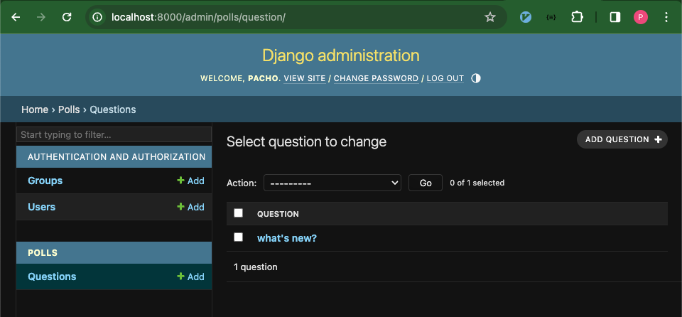

## django admin

django는 프로젝트에서 다루는 컨텐츠, 데이터들을 쉽게 조작할 수 있도록 admin site를 제공한다. 그래서 django로 서비스를 구축하면 서비스 운영을 위한 백오피스를 만들기가 수월하다.

### admin user 생성

처음 django admin을 설치하면 user가 없는 상태이다. superuser를 직접 만들어준다.
```
# poetry shell 활성화 상태
(django-practice-py3.12) $ python manage.py createsuperuser 
Username (leave blank to use 'han'): pacho
Email address: pacho@example.com  
Password: 
Password (again): 
This password is too common.  # password 입력 시 validation을 거치며  너무 흔한(ex. password, test, ...) 값을 입력하면 경고한다.
Bypass password validation and create user anyway? [y/N]: y
Superuser created successfully.
```

서버를 시작하고 admin 페이지에 접속해서 방금 생성한 superuser 정보로 로그인 할 수 있다.
```
(django-practice-py3.12) $ python manage.py runserver
```


admin site에는 앞서 만들었던 polls app에 관련된 항목은 보이지 않는다. admin site에서 app을 관리하려면 admin site에서 관리할 대상에 polls app을 등록 해야 한다.

`polls/admin.py`
```python
from django.contrib import admin
from .models import Question

admin.site.register(Question)
```

저장 후 admin site에 polls 타이틀과 Questions항목이 생긴 것을 확인할 수 있다.



끝.
