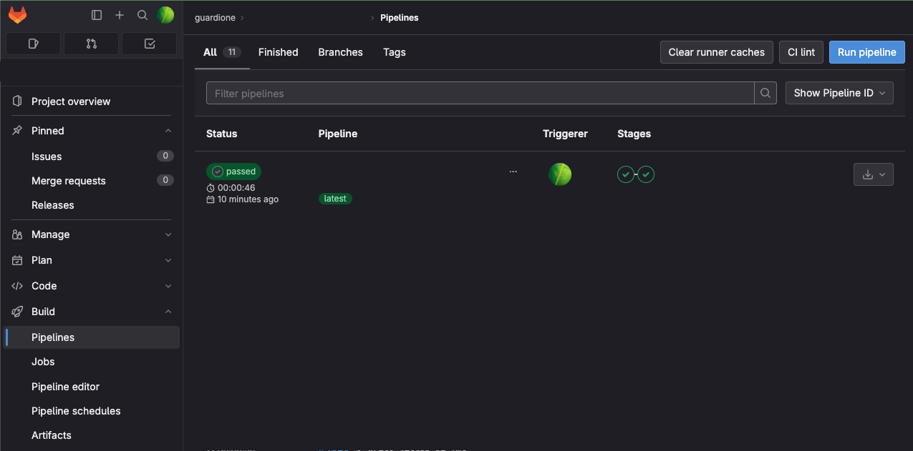
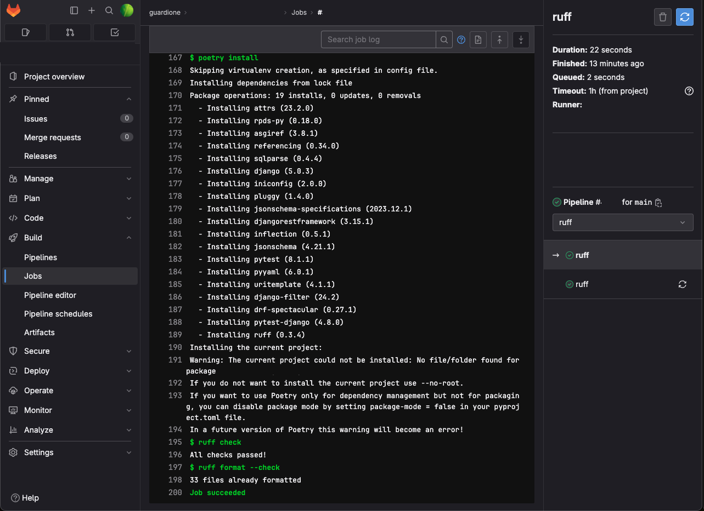

## GitLab-CI

GitLab-CI를 적용하는 과정과 함께 CI 자동화에 대한 경험을 기록한다.

참조: https://docs.gitlab.com/ee/ci/index.html

### CI란?

CI(Continuous Integration)는 소프트웨어 개발 방법론 중 하나로, 코드 변경사항을 빈번하게 통합하고 빌드하여 자동화된 테스트를 실행하여 품질을 유지하는 프로세스를 말한다. 이를 통해 개발자들은 협업과 통합을 용이하게 하고, 빠른 피드백을 통해 문제를 조기에 발견하여 수정할 수 있다.

### .gitlab-ci.yml

코드 형상관리를 위해 gitlab을 사용한다면, repository에 `.gitlab-ci.yml``파일을 추가하여 해당 원격 저장소의 branch들에 발생하는 모든 commit에 대해 실행되도록 설정할 수 있다. gitlab MR의 merge 조건에 CI가 통과 되었을때만 merge 가능하도록 설정할 수도 있다.

### Runner

Runners는 작업을 실행하는 에이전트이다. 이러한 에이전트는 물리적 머신이나 가상 인스턴스에서 실행될 수 있으며 `.gitlab-ci.yml` 파일에서 작업을 실행할 때 사용할 컨테이너 이미지를 지정할 수 있다.

Runner는 이미지를 로드하고 프로젝트를 복제한 후 작업을 로컬로 또는 컨테이너 내에서 실행한다.

`GitLab.com`을 사용하는 경우 Linux, Windows 및 macOS에서 이미 사용 가능한 Runners가 있고, 직접 Runners를 등록할 수도 있다.
`GitLab.com`을 사용하지 않는 경우 Self-managed 인스턴스에 Runners를 등록할 수 있다. 또는 로컬 머신에 Runner를 만들 수도 있다.

### Pipeline

Pipeline은 작업(job)과 단계(stage)로 구성된다.

작업(job)은 어떤 것을 할 지에 대한 정의로서 Test 코드를 실행하거나 결과물을 배포하는 등의 동작을 정의할 수 있다.
단계(stage)에는 최소한 하나의 작업이 포함되어 있으며 일반적인 단계는 빌드, 테스트, 배포 등으로 구성한다.

### 실습

`.gitlab-ci.yml`
```
# runner를 실행할 image를 설정
image: python:3.12-slim

# lint로 사용한 ruff 를 실행하는 단계와 test 코드를 실행하는 단계로 구성했다.
stages:
  - ruff
  - test

# script를 실행하기 전에 위에서 설정한 image에 poetry를 설치, 의존성 패키지를 설치한다.
before_script:
  - pip install poetry
  - poetry config virtualenvs.create false
  - poetry install

# stages
ruff:
  stage: ruff
  script:
    - ruff check  # pyproject.toml에서 설정한 ruff rule에 따라 검사
    - ruff format --check  # format이 맞춰져있는지 검사

test:
  stage: test
  script:
        - poetry run python manage.py test --verbosity 2  # test code 실행
```

위와 같이 작성하면 원격저장소에 해당 브랜치에 commit이 생길때마다 Pipelines 페이지에서 각 단계들이 실행되는 것과 결과를 실시간으로 확인할 수 있다.




끝.
